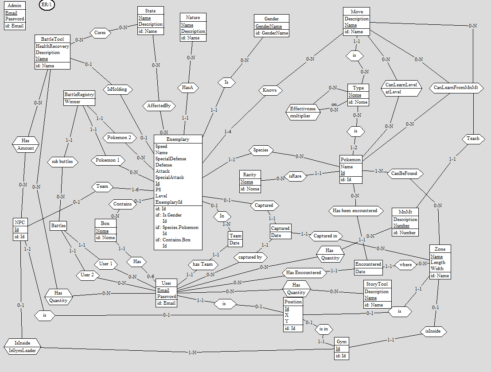

# Query complesse Pokemon Crocoite

## Introduzione
Questo documento racchiude le idee per effettuare le query statistiche più complesse sui pokemon.

## Diagramma ER
Il diagramma ER è il seguente: \    


## Classe A

### Utenti con le squadre più variegate
> Mostra i primi 10 utenti con con le squadre più variegate in termini di tipi di pokemon ed in secondo luogo di tipi di mosse conosciute dai pokemon.
```sql
select t1.pokemon_types, t2.move_types, t1.user_id from (
    select count(distinct name) as pokemon_types, user_id
        from(
        SELECT DISTINCT t.*, teams.user_id from teams inner join exemplaries e on e.team_id = teams.id inner join pokemon p on p.id = e.pokemon_id inner join pokemon_type pt on pt.pokemon_id = p.id inner join types t on t.id = pt.type_id) as Salamalecum GROUP By user_id
) as t1
	inner join (select count(distinct id) as move_types, user_id from (
SELECT DISTINCT t.*, teams.user_id from teams inner join exemplaries e on e.team_id = teams.id inner join exemplary_move em on em.exemplary_id = e.id inner join moves m on m.id = em.move_id inner join types t on t.id = m.type_id )as vnjdvfnd group by user_id) as t2 on t1.user_id = t2.user_id
order by t1.pokemon_types DESC, t2.move_types DESC
```

### Pokemon con miglior miglioramento medio
> Mostra i primi 10 pokemon con il miglior miglioramento medio in termini di statistiche base.

```sql
select avarage_final, qf.id from (
select avg(avarage_final) as avarage_final, p.id from pokemon p inner join (
select e.id, pokemon_id, pa.avarage - (speed + specialDefense + specialAttack + attack + defense) / 5 as avarage_final from exemplaries e inner join (select id, (speed + specialDefense + specialAttack + attack + defense) / 5 as avarage from exemplaries 
     where exemplary_id is null) pa on pa.id = e.exemplary_id inner join captureds c on c.exemplary_id = e.id where e.exemplary_id is not null

    ) as ex on ex.pokemon_id = p.id
    GROUP by p.id
    ) as qf order by qf.avarage_final desc


Rarita più vincenti
SELECT
    r.name AS rarity_name,
    COUNT(*) AS win_count
FROM
    (
        SELECT
            CASE
                WHEN b.winner = 1 THEN e1.pokemon_id
                WHEN b.winner = 2 THEN e2.pokemon_id
            END AS winning_pokemon_id
        FROM
            battle_registries b
        JOIN
            exemplaries e1 ON b.exemplary1_id = e1.id
        JOIN
            exemplaries e2 ON b.exemplary2_id = e2.id
    ) AS winners
JOIN
    pokemon p ON winners.winning_pokemon_id = p.id
JOIN
    rarities r ON p.rarity_id = r.id
GROUP BY
    r.name
ORDER BY
    win_count DESC;

```

Extra:
> Una classifica delle zone con il miglior miglioramento medio in termini di statistiche base.

### Utenti con il maggior numero di pokemon di ogni rarità catturati
> Mostra i primi 10 utenti con il maggior numero di pokemon di ogni rarità catturati.

L'utente dovrà selezionare la rarità di cui vuole visualizzare i primi 10 utenti.

### Rarità più vincenti
> Mostra le  rarità con il maggior numero di vittorie.

### Migliori zone con i pokemon più forti
> Mostra le prime 10 zone con i pokemon più forti in termini di statistiche base (al momento della cattura).

```sql
select sum(speed + specialDefense + specialAttack + attack + defense) as power, c.zone_id from exemplaries e
    join captureds c on c.exemplary_id = e.id
GROUP by c.zone_id 
order by power desc
```

### Tipo di pokemon più efficace contro un allenatore
> Mostra il tipo di pokemon più efficace contro un allenatore.

```sql
with BattlesWinner as (
select 
    CASE
    	WHEN br.winner = 1 then br.exemplary1_id
    	WHEN br.winner = 2 then br.exemplary2_id
    END as winner,
    CASE
    	WHEN br.winner = 1 then br.exemplary2_id
    	WHEN br.winner = 2 then br.exemplary1_id
    END as loser,
    br.battle_id
    from battle_registries br
)

select count(distinct e.exemplary_id) as win_amount, e.exemplary_id from exemplaries e
join teams t on t.id = e.team_id
join BattlesWinner bw on bw.winner = e.id
join battles b on b.id = bw.battle_id
where (b.user_1 = 2 or b.user_2 = 2) and t.user_id <> 2
group by  e.exemplary_id
```

Extra:
> Mostra il tipo di pokemon più efficace in generale.

```sql
with BattlesWinner as (
select 
    CASE
    	WHEN br.winner = 1 then br.exemplary1_id
    	WHEN br.winner = 2 then br.exemplary2_id
    END as winner,
    CASE
    	WHEN br.winner = 1 then br.exemplary2_id
    	WHEN br.winner = 2 then br.exemplary1_id
    END as loser
    from battle_registries br
)

select count(*) as amount, exemplary_id from exemplaries e
join BattlesWinner bw on bw.winner = e.id
group by exemplary_id
order by amount desc
```

### Analisi mosse più efficaci
> Mostra le mosse più efficaci in termini di vittorie.

Questa query analizza le mosse più efficaci in base ai risultati delle battaglie. Deve calcolare il tasso di
successo di ogni mossa e classificare le mosse in base a questo tasso. Ovvero effettuare una classifica delle
mosse più comuni tra i pokemon che vincono più battaglie

```sql
with BattlesWinner as (
select 
    CASE
    	WHEN br.winner = 1 then br.exemplary1_id
    	WHEN br.winner = 2 then br.exemplary2_id
    END as winner,
    CASE
    	WHEN br.winner = 1 then br.exemplary2_id
    	WHEN br.winner = 2 then br.exemplary1_id
    END as loser
    from battle_registries br
)

select  count(m.id) as amount, m.id, m.name from exemplaries e
join BattlesWinner bw on bw.winner = e.id
join exemplary_move em on em.exemplary_id = e.id
join moves m on m.id = em.move_id
group by m.id
order by amount desc
```

## Classe B

### Numero di battaglie vinte e perse per ogni allenatore
> Mostra il numero di battaglie vinte e perse per ogni allenatore.

### Esemplare più catturato
> Mostra il pokemon più catturato.

### Allenatori con i pokemon più forti
> Mostra i primi 10 allenatori con i pokemon più forti in termini di statistiche base.
